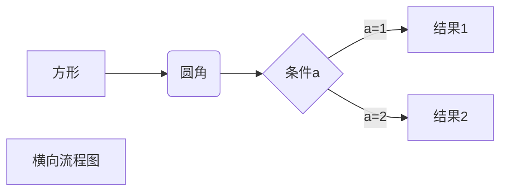

# Markdown学习手册
## 1，标题的使用
使用``#``来表示几级标题，几个``#``表示是几级

## 2，段落
段落是使用``两个空格+一个回车``来实现的。也可以一个段落后面使用``空行``来表示重开一个新的段落  
## 3字体
*斜体文本*  
**粗休文本**  
***粗斜体文本***  
## 4分隔线
***
---
___  

## 5删除线
~~这是要删除的文本~~  
就是在文本前后都加上``~~``就可以了  

## 6下划线
下线线可以通过HTML的``<u>``标签来实现  
<u>这就是一个例子</u>    

## 7脚注
脚注是对文本的补充说明。  
比如我现在说了一个事引用了别的地方 [ ^RUNOOB ]。  
[^RUNOOB ]: 这就是我要引用的东西  
## 8列表
   #### 1. 无序列表  
   使用``*``,``+``,``-``后面加一个``空格``就可以了
   * 第一项
   - 第二项
   + 第三项
     + 一个小分项
     + 小分项用``Tab``可以实现
   #### 2. 有序列表
   使用``数字+.+空格``来实现
   1. 第一项
      1. 也是``Tab``来实现
      2. 一样的

## 9区块
区块引用是在段落开头使用``'>'+'空格'``来实现的
> 这是一个区块  
> 区块中可以写很多东西
> >这是一个嵌套的区块  
> >可以是好几个  

#### 列表中也是可以区块的
- 第一项
>区块一  
>区块二  
>>小内容  
>>别一个内容
- 第二项

## 10代码块 
段落中的一个函数或都代码可以用`` ` ``包起来，`print()`  
代码可以用`` 4个空格 ``或一个`` Tab ``包起来：  
比如：  

    import turtle
    t=turtle.Pen()
    turtle.done()
也可以用``  两个' ``` ' ``包起来,可以在第一个`` ``` ``后面加上你用的什么语言的代码  

比如：  ```python```
```python
import turtle
t=turtl.Pen()
turtle.done()
```

## 11，链接
这是我的 [github ](https://github.com/xielh55555/Markdown.git)网址

## 12，图标  
  


## 13，表格  
表格是``|``来分单元格，用``-``来分表头和其它行  
比如：  
| 表头 | 表头 |  
|-|-|
|单元格|单元格|  

|  表头   | 表头  |
|  ----  | ----  |
| 单元格  | 单元格 |
| 单元格  | 单元格 |  

- `` -: ``居右对齐  
- `` :- ``居左对齐
- `` :-: ``居中  

## 14，高级技巧  
#### 1. 支持HTML元素  
目前支持的 HTML 元素有：< kbd> < b> < i> < em> < sup> < sub> < br>等 。  
比如：

使用 <kbd>Ctrl</kbd>+<kbd>Alt</kbd>+<kbd>Del</kbd> 重启电脑  
#### 2. 转义  
**文本加粗**   
\*\* 正常显示星号 \*\*

``` \ ```     反斜线  
``` ` ```    反引号  
`` *``   星号  
``_ ``  下划线
``{}``  花括号  
``[]``  方括号  
``()``  小括号  
``# ``  井字号  
``+``   加号  
``-``   减号  
``.``   英文句点  
``!``   感叹号    

## 15，公式  
当你需要在编辑器中插入数学公式时，可以使用两个美元符 ``$$`` 包裹 ``TeX`` 或 ``LaTeX`` 格式的数学公式来实现。提交后，问答和文章页会根据需要加载 ``Mathjax`` 对数学公式进行渲染。  
比如：
```
$$
\mathbf{V}_1 \times \mathbf{V}_2 =  \begin{vmatrix} 
\mathbf{i} & \mathbf{j} & \mathbf{k} \\
\frac{\partial X}{\partial u} &  \frac{\partial Y}{\partial u} & 0 \\
\frac{\partial X}{\partial v} &  \frac{\partial Y}{\partial v} & 0 \\
\end{vmatrix}
${$tep1}{\style{visibility:hidden}{(x+1)(x+1)}}
$$
```  
结果为：  
$$
\mathbf{V}_1 \times \mathbf{V}_2 =  \begin{vmatrix} 
\mathbf{i} & \mathbf{j} & \mathbf{k} \\
\frac{\partial X}{\partial u} &  \frac{\partial Y}{\partial u} & 0 \\
\frac{\partial X}{\partial v} &  \frac{\partial Y}{\partial v} & 0 \\
\end{vmatrix}
${$tep1}{\style{visibility:hidden}{(x+1)(x+1)}}$$   
这里没有渲染出来  


##   16，笔记
```

```

